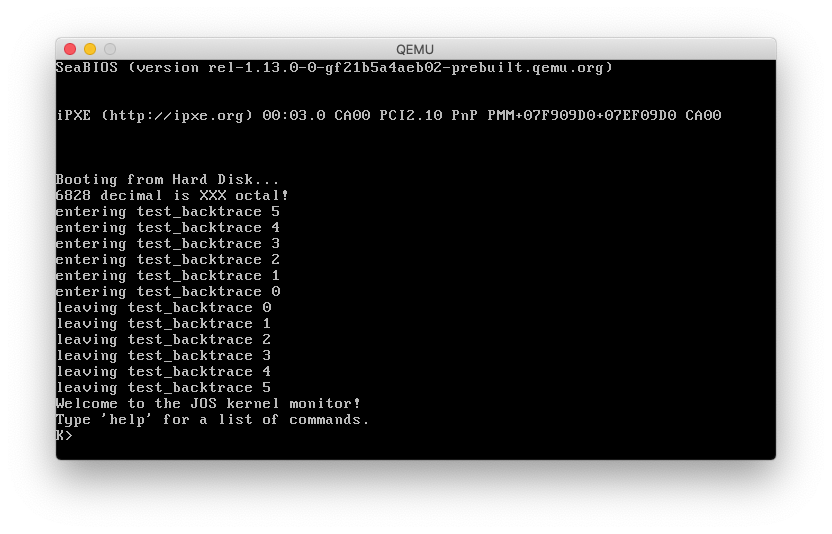
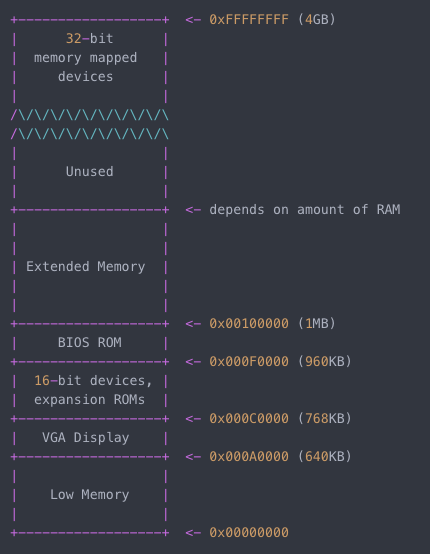
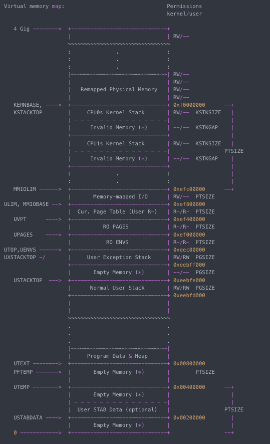
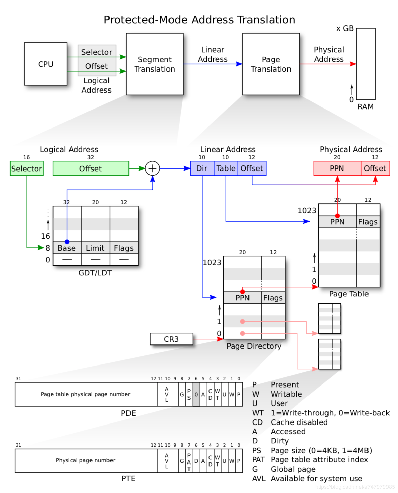
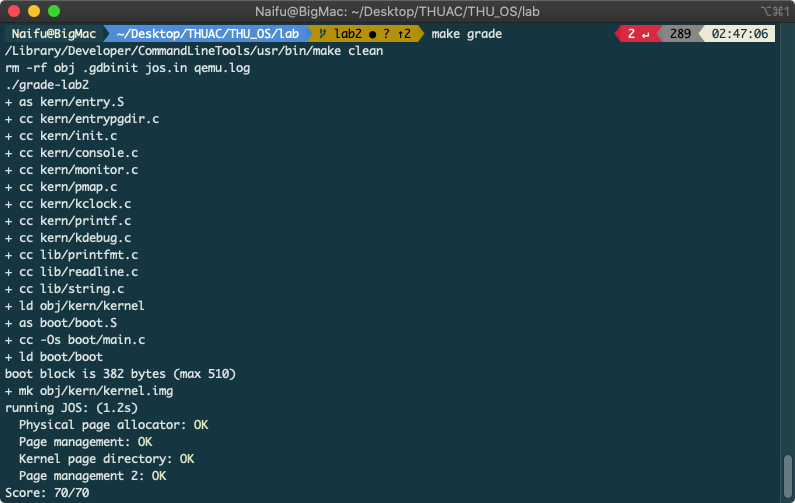
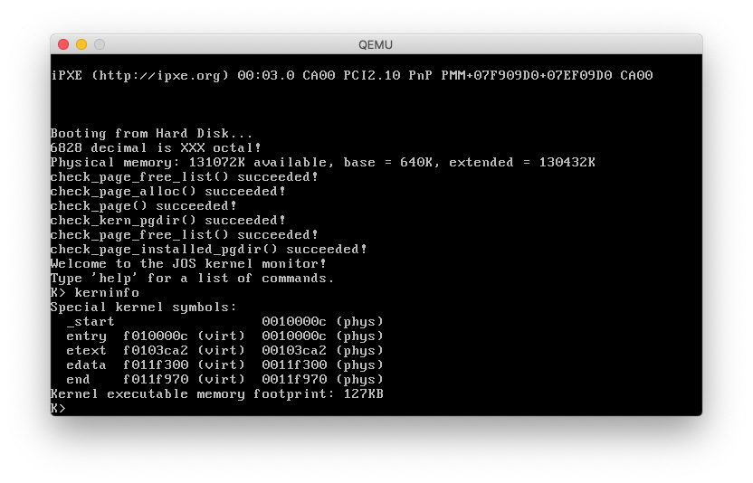

# 《操作系统》结课报告
2018280351 Zhang Naifu 张乃夫
[github: https://github.com/Funaizhang/THUAC/tree/master/MIT_6828](https://github.com/Funaizhang/THUAC/tree/master/MIT_6828)

## 灵感来源

谌老师课上讲过了一些操作系统的基本理论知识，但毕竟觉得没动过手，掌握的就不是很牢。就像费曼说的：What I cannot create, I do not understand. 所以我就想着自己实现操作系统的一部分。因为没有FPGA之类的可用的CPU，就要找一个合适的CPU模拟器。网上查找之后发现 MIT 6.828 2018 [[1]](https://pdos.csail.mit.edu/6.828/2018/index.html) 提供的一些支持最合适。

这个项目的工作就是在 MIT 所提供的 JOS 系统框架下，用 **C语言** 实现 **内存管理 Memory Management**。具体内容分为2部分：**物理页面的管理** 与 **虚拟地址的映射与管理**。工作量等同于 MIT 6.828 Lab1 [[2]](https://pdos.csail.mit.edu/6.828/2018/labs/lab1/) & Lab2 [[3]](https://pdos.csail.mit.edu/6.828/2018/labs/lab2/)。

## 配置环境

首先，任何操作系统的开发都会需要主要3个环境配置。MIT 网站提供了这些工具。

1. x86仿真器QEMU，用于模拟CPU、运行 JOS 内核
2. 内核的基本框架和功能（毕竟不可能实现整个操作系统）
3. 编译器工具链，包括汇编器，链接器，C编译器和调试器，用于编译和测试内核

接下来就是第一步，如何把这个系统在自己的机子上启动起来。由于所有binaries都是基于 `32bits Linux` 系统的 ELF 格式，而作者用的是 `64bits MacOS 10.15 Catalina`，编译程序自然会出现问题。还好 MacOS 提供了交叉编译器`i386-elf-gcc`、`i386-elf-gdb`、`i386-elf-binutils`三件套，可以生成ELF内核映像。最后再把 `GNUmakefile` 的一些参数与链接改一下就可以 make 了。参考 [[4]](https://blog.csdn.net/brynjiang/article/details/89713673?utm_medium=distribute.pc_relevant.none-task-blog-BlogCommendFromMachineLearnPai2-1.nonecase&depth_1-utm_source=distribute.pc_relevant.none-task-blog-BlogCommendFromMachineLearnPai2-1.nonecase)。

<!-- 修改GNUmakefile:
```make
gdb:
	i386-jos-elf-gdb -n -x .gdbinit
``` -->

编译成功后，QEMU 仿真界面是这个样子的：



## 内核初始化

首先，我们要把内核加载到内存里。

PC的物理地址空间的结构如下：



QEMU 初始化时会硬连线执行 `0x000ffff0` 地址的汇编指令，也就是 `Basic Input/Output System (BIOS)` 的程序。BIOS 会从硬盘中加载 boot loader 到 Base Memory 里的 `0x00007c00`。 然后Boot loader 将处理器从 `16-bit real mode` 切换到 `32-bit protected mode`，修改`CR0_PG`寄存器的值，使得1M以上的内存地址可以访问。接下来，boot loader从硬盘中读取内核到内存并跳转到内核入口地址 —— Extended Memory/RAM 里的 `0x00100000`。最后控制交给内核。

还有值得一提的是，stack在用虚拟地址 `0xf0108000`～`0xf0110000`。


## 内存管理

接下来，我们将映射PC的整个底部256MB物理地址空间，也就是把物理地址 `0x00000000`～`0x0fffffff` 映射到虚拟地址 `0xf0000000`～`0xffffffff`。

内存管理具体包含以下两个部分。


### 物理内存分配器 Physical Page Management

我们的主要任务是维护一个数据结构 `pages` & `PageInfo`，记录哪些物理页是空闲的，哪些是已分配的，以及多少进程正在共享每页。还需编写出分配和释放内存的页的过程。

分配器以页面为单位，每个页面4KB。JOS用page granularity来管理物理内存以便它可以使用MMU去映射和保护分配的每一块内存。

具体的任务是填写`kern/pmap.c`里的几个函数。系统通过 **mem_init()** 函数把这些结构体建立起来，**page_init()** 把空闲页标记出来。然后适当的时候调用 **page_alloc()** 和 **page_free()** 来标记空闲或占用页。

* **boot_alloc()** 用来初始化页目录，分配足够的连续物理内存页以容纳n字节，返回内核虚拟地址。分配n字节内存。这个函数的核心就是维护 `nextfree`，代表可以使用的空闲内存空间的虚拟地址。


```C
// LAB 2: Your code here.

result = nextfree;
nextfree = ROUNDUP(nextfree + n, PGSIZE);

if((uint32_t)nextfree > KERNBASE + (npages * PGSIZE)) {
  panic("Out of memory!\n");
}

return result;
```

* **mem_init()** 等同于一个初始化 `PageInfo` 的函数。分配`npages` 个 `PageInfo` 数组并将其存储在 `pages` 中。系统内核就是通过这个数组来追踪所有内存页的使用情况的。

```C
// Your code goes here:

size_t PageInfo_size = sizeof(struct PageInfo);
pages = boot_alloc(npages * PageInfo_size);
memset(pages, 0, npages * PageInfo_size);
```

* **page_init()** 用来初始化pages结构和内存空闲链表。空闲页通过 `page_free_list` 这个栈来完成页面的申请和调用。注意不可以把BIOS、IO hole和内核当作可用空间。

```C
// Change the code to reflect this.

size_t i;
for (i = 0; i < npages; i++) {
  if (i==0){
    // Mark physical page 0 as in use.
    // This way we preserve the real-mode IDT and BIOS structures
    // in case we ever need them.
    pages[i].pp_ref = 1;
    pages[i].pp_link = NULL;
  } else if (i < npages_basemem) {
    // The rest of base memory, [PGSIZE, npages_basemem * PGSIZE)
    // is free.
    pages[i].pp_ref = 0;
    pages[i].pp_link = page_free_list;
    page_free_list = &pages[i];
  } else if (i >= IOPHYSMEM/PGSIZE && i < EXTPHYSMEM/PGSIZE) {
    // Then comes the IO hole [IOPHYSMEM, EXTPHYSMEM), which must
    // never be allocated.
    pages[i].pp_ref = 1;
    pages[i].pp_link = NULL;
  } else if (i >= EXTPHYSMEM/PGSIZE && i < PGNUM(PADDR(boot_alloc(0)))){
    // Extended memory occupied by kernel [EXTPHYSMEM, nextfree maintained by
    // boot_alloc() to be marked occupied
    pages[i].pp_ref = 1;
    pages[i].pp_link = NULL;
  } else {
    // Rest of the extended memory is free
    pages[i].pp_ref = 0;
    pages[i].pp_link = page_free_list;
    page_free_list = &pages[i];
  }
}
```

* **page_alloc()** 分配物理页。通过读取和更新 `page_free_list` 来申请页面，然后返回对应的 `PageInfo` 结构体。

```C
// Fill this function in

struct PageInfo *current = NULL;

if (page_free_list){
  current = page_free_list;
  page_free_list = page_free_list->pp_link;
  current->pp_link = NULL;

  if (alloc_flags & ALLOC_ZERO) {
      memset(page2kva(current), 0, PGSIZE);
  }
}

return current;
```

* **page_free()** 释放物理页，很简单。

```C
// Fill this function in

if (pp->pp_ref != 0 || pp->pp_link != NULL) {
  panic("page_free error!");
} else {
  pp->pp_ref = 0;
  pp->pp_link = page_free_list;
  page_free_list = pp;
}
return;
```


### 虚拟内存分配器 Virtual Page Management

内存管理的第二部分是虚拟内存管理。这个实验要实现的是二级分页，使虚拟内存将内核以及用户软件利用的虚拟地址映射到物理内存地址。

虚拟内存结构如下：


如下图所示，实验采用 Page Directory 和 Page Table 两级页表。采用两级页表的原因是一级页表的空间利用率非常低，存在着大量的浪费。

CPU接到Logical Address，经过分段机制转换成Linear Address，再经过分页机制转换成Physical Address。程序里面的所有地址，都是虚拟地址。程序里面是不会出现物理地址的，就算是物理地址，CPU也会把它当做虚拟地址，通过MMU转化为物理地址。当前阶段的JOS分段机制就是加一个偏移量，所以可以直接认为CPU得到的虚拟地址就是线性地址，只需要经过page translation就可以得到物理地址了。



图片来源 [[5]](https://blog.csdn.net/fang92/article/details/47320747)

每个程序都有个 Page Directory，含有 1K 个 PDE。每个 PDE 4B，前20位指向一个 Page Table，每个 Page Table 又含有 1K 个 PTE。每个 PTE 4B，前20位与 Linear Address 的 Offset 字段合在一起就可以指向一个 page 的物理地址了。所以每个程序都觉得自己能独占4GB的虚拟内存 1K (no. of PDE) X 1K (no. of PTE) X 4KB (PageSize)。

参照上图，二级页表分页大致过程是这样的：
1. Logical Address 加一个偏移量，得到 Linear Address
2. Page Directory 的入口地址存储在CR3寄存器中，读取CR3寄存器的高20位，低12位根据 Linear Address 的高10位得到
3. 通过 Linear Address 前10位得到PDE，取出存在 PDE 中的 Page Table 的地址
4. 结合 Linear Address 中10位，查找 Page Table，得到 Physical Address 的前20位
5. Physical Address 后12位 Offset 来自 Linear Address 后12位

实验的具体任务是写`kern/pmap.c`里的几个函数，以设置MMU的页表，必要时申请内存。

* **pgdir_walk()**。给定一个虚拟地址 va 和 pgdir (Page Directory 的首地址), 返回 va 所对应的 PTE。当 va 对应的页表存在时，按照页面翻译给出 PTE；当 va 对应的页表还没有被创建的时候，需要创建页面，然后再返回 PTE 的虚拟地址。

```C
// Fill this function in
struct PageInfo *new_page = NULL;
pde_t *pde = &pgdir[PDX(va)];

if (!(*pde & PTE_P) && !create){
	return NULL;
}
// No Page Table associated with va, need to create
else if (!(*pde & PTE_P) && create) {
  new_page = page_alloc(1);
  // Allocation failed
  if (new_page == NULL) {
  	return NULL;
  }
  new_page->pp_ref += 1;
  *pde = (page2pa(new_page) | PTE_P | PTE_U | PTE_W);
}
// Translation
pte_t *pte_base = KADDR(PTE_ADDR(*pde));
return &pte_base[PTX(va)];

```

* **boot_map_region()** 把 [va, va + size) 映射到 [pa, pa + size)。

```C
// Fill this function in
int offset;
pte_t *pt;
for (offset = 0; offset < size; offset += PGSIZE) {
  pt = pgdir_walk(pgdir, (void *)va, 1);
  *pt = pa | perm | PTE_P;
  pa += PGSIZE;
  va += PGSIZE;
}

```

* **page_lookup()** 返回虚拟地址 va 对应的物理地址的页面。

```C
// Fill this function in
pte_t *pte = pgdir_walk(pgdir, va, 0);
if (pte == NULL) {
  return NULL;
}
if (pte_store != 0) {
    *pte_store = pte;
}
if (*pte & PTE_P) {
    return pa2page(PTE_ADDR(*pte));
}
return NULL;

```

* **page_remove()** 删除虚拟地址 va 和它的物理地址的映射关系。

```C
// Fill this function in
pte_t *pte;
struct PageInfo *page = page_lookup(pgdir, va, &pte);
if (page) {
  page_decref(page);
  *pte = 0;
  tlb_invalidate(pgdir, va);
}

```

* **page_insert()** 把虚拟地址va 映射到指定的物理页表。

```C
// Fill this function in
pte_t *pte = pgdir_walk(pgdir, va, 1);

// If page table couldn't be allocated
if (pte == NULL) {
  return -E_NO_MEM;
}

pp->pp_ref++;
// va currently maps to a different page
if (*pte & PTE_P){
  page_remove(pgdir, va);
}

// Mapping of va to page
*pte = page2pa(pp) | perm | PTE_P;
return 0;

```

最后，在 **mem_init()** 里进行虚拟地址与物理地址各区间的映射。

```C
// Your code goes here:
boot_map_region(kern_pgdir, UPAGES, PTSIZE, PADDR(pages),PTE_U);
// Your code goes here:
boot_map_region(kern_pgdir, KSTACKTOP-KSTKSIZE, KSTKSIZE, PADDR(bootstack), PTE_W);
// Your code goes here:
boot_map_region(kern_pgdir, KERNBASE, (0xffffffff-KERNBASE), 0, PTE_W);
```


大功告成，通过 MIT 给的测试。



此时，打开 QEMU 模拟CPU，可以看到内存设置成功。`kerninfo` 把虚拟地址与对应的物理地址列出来了。



## 遇到的问题
* 久疏C语言，自觉面目可憎。
* 没学过汇编与反汇编，尤其对gcc、makefile等不熟。导致环境搭建就花了1天。
* 对于gdb的使用不熟。
* 作者为留学生，中文写作较吃力，报告可能有若干处表述不清。


## 总结
此实验实现了 **物理内存的页式管理** 与 **虚拟地址空间的映射** 的一些基础功能。作者通过实验更加熟悉了分页地址转换和内存管理。

总体感想是魔鬼都在细节。虽然感觉没做什么东西，却debug了好久。有几处没想清楚的地方，只在参考别人的实现，照葫芦画瓢后才做出来。实验需要阅读、消化大量代码，而且代码分布在不同的文件。现在还有些文件没搞懂，可能后续Lab会用到吧。三到四天内完全搞清楚 Lab1 & Lab2 非常具有挑战性。

最后，借用《自己动手写CPU》中的一句话：学无止境，科技发展亦日新月异，唯有持续钻研，从根本上理解世界之运行，方能大成。

详细代码请见 [github: https://github.com/Funaizhang/THUAC/tree/master/MIT_6828](https://github.com/Funaizhang/THUAC/tree/master/MIT_6828)

## 参考
* [1] [MIT 6.828 2018](https://pdos.csail.mit.edu/6.828/2018/index.html)
* [2] [MIT 6.828 Lab1](https://pdos.csail.mit.edu/6.828/2018/labs/lab1/)
* [3] [MIT 6.828 Lab2](https://pdos.csail.mit.edu/6.828/2018/labs/lab2/)
* [4] [CSDN博客 MIT6.828 JOS在Mac下的环境配置](https://blog.csdn.net/brynjiang/article/details/89713673?utm_medium=distribute.pc_relevant.none-task-blog-BlogCommendFromMachineLearnPai2-1.nonecase&depth_1-utm_source=distribute.pc_relevant.none-task-blog-BlogCommendFromMachineLearnPai2-1.nonecase)
* [5] [CSDN博客 MIT6.828 虚拟地址转化为物理地址](https://blog.csdn.net/fang92/article/details/47320747)
* [6] [Xin Qiu MIT 6.828 Lab2](https://xinqiu.me/2016/12/09/MIT-6.828-2/)
